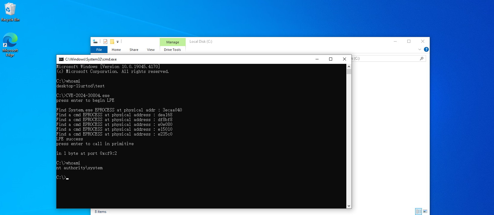

# Vulnerable Driver AsInsHelp64.sys in ASUS Fan_Xpert   

---

ASUS Fan_Xper is used to control the fan speed. Many vulnerability exits in it's driver AsInsHelp64.sys Before version 10013, which allows low-privileged users to map arbitrary physical memory, read and write arbitary i/o port via specially crafted IOCTL requests. This can be exploited for privilege escalation, code execution under high privileges, and information disclosure. These signed drivers can also be used to bypass the Microsoft driver-signing policy to deploy malicious code.  

Using AsInsHelp64.sys as example,  AsInsHelp32.sys is also similar.

## version

10013

## Vulnerability causes

AsInsHelp64.sys  provides the functionality of mapping physical memory and In/Out I/O ports, but it does not restrict the privileges of the caller, resulting in low-privileged users being able to call the driver and execute corresponding functions through DeviceIoControl.

~~~c
__int64 __fastcall sub_116F0(__int64 a1, __int64 a2) // ioctler
{
  char is32bitprocess; // si
  __int64 v5; // rdx
  int v6; // ebx
  char v7; // al
  unsigned int v8; // eax
  void *v9; // rdx
  __int64 v10; // rax

  is32bitprocess = IoIs32bitProcess((PIRP)a2);
  *(_QWORD *)(a2 + 56) = 0i64;
  v5 = *(_QWORD *)(a2 + 184);
  v6 = -1073741822;
  v7 = *(_BYTE *)v5;
  if ( !*(_BYTE *)v5 || v7 == 2 )
  {
    v6 = 0;
    goto LABEL_28;
  }
  if ( v7 != 14 )
    goto LABEL_28;
  v8 = *(_DWORD *)(v5 + 24);
  if ( v8 > 0xA0406408 )
  {
    if ( v8 == 0xA040A440 || v8 == 0xA040A444 || v8 == 0xA040A448 )
      v6 = sub_11110(a2, v5, is32bitprocess);   // out arbitary I/O port
    goto LABEL_28;
  }
  switch ( v8 )
  {
    case 0xA0406408:
LABEL_10:
      v6 = sub_11000(a2, v5);                   // in arbitary I/O port
      break;
    case 0xA040244C:
      v6 = sub_112F0(a1, a2, *(_QWORD *)(a2 + 184), is32bitprocess);// map physical address
      if ( v6 < 0 )
      {
        *(_DWORD *)(a2 + 48) = -1073741811;
      }
      else
      {
        v10 = 8i64;
        if ( is32bitprocess )
          v10 = 4i64;
        *(_QWORD *)(a2 + 56) = v10;
      }
      break;
    case 0xA0402450:
      if ( is32bitprocess )
      {
        if ( *(_DWORD *)(v5 + 16) >= 4u )
        {
          v9 = (void *)**(unsigned int **)(a2 + 24);
LABEL_14:
          v6 = ZwUnmapViewOfSection((HANDLE)0xFFFFFFFFFFFFFFFFi64, v9);
          break;
        }
      }
      else if ( *(_DWORD *)(v5 + 16) >= 8u )
      {
        v9 = **(void ***)(a2 + 24);
        goto LABEL_14;
      }
      v6 = -1073741670;
      break;
    case 0xA0406400:
    case 0xA0406404:
      goto LABEL_10;
  }
LABEL_28:
  *(_DWORD *)(a2 + 48) = v6;
  IofCompleteRequest((PIRP)a2, 0);
  return (unsigned int)v6;
}
~~~

### IOCTL  0xA040244C 

This IOCTL code triggers the mapping of physical memory. The composition of the input buffer is as follows.

~~~c
#pragma pack (1) 
typedef struct {
	ULONG64	junk1;
	ULONG64 section_offset; // The physical address you want to map.
	DWORD junk2;			
	DWORD view_size;		// How many bytes
} AsInsHelp64_Map_Inputbuffer;
#pragma pack()
~~~

The memory mapping is eventually completed by calling ZwMapViewOfSection.

~~~c
__int64 __fastcall sub_112F0(__int64 a1, __int64 a2, __int64 a3, bool is32bitprocess)
{
  PHYSICAL_ADDRESS *v5; // rdi
  _DWORD *v6; // r13
  NTSTATUS v7; // ebx
  HANDLE v8; // rcx
  _DWORD *v9; // r14
  DWORD v10; // ecx
  DWORD LowPart; // eax
  void *SectionHandle; // [rsp+50h] [rbp-D8h] BYREF
  ULONG AddressSpace; // [rsp+58h] [rbp-D0h] BYREF
  LARGE_INTEGER TranslatedAddress; // [rsp+60h] [rbp-C8h] BYREF
  union _LARGE_INTEGER SectionOffset; // [rsp+68h] [rbp-C0h] BYREF
  HANDLE Handle; // [rsp+70h] [rbp-B8h] BYREF
  ULONG_PTR ViewSize; // [rsp+78h] [rbp-B0h] BYREF
  PHYSICAL_ADDRESS BusAddress; // [rsp+80h] [rbp-A8h] BYREF
  PVOID Object; // [rsp+88h] [rbp-A0h] BYREF
  PVOID v21; // [rsp+90h] [rbp-98h] BYREF
  ULONG v22; // [rsp+98h] [rbp-90h] BYREF
  PVOID BaseAddress; // [rsp+A0h] [rbp-88h] BYREF
  struct _OBJECT_ATTRIBUTES ObjectAttributes; // [rsp+A8h] [rbp-80h] BYREF
  struct _UNICODE_STRING DestinationString; // [rsp+D8h] [rbp-50h] BYREF

  v5 = *(PHYSICAL_ADDRESS **)(a2 + 24);
  AddressSpace = v5[2].LowPart;
  v22 = AddressSpace;
  Handle = 0i64;
  v21 = 0i64;
  LODWORD(SectionHandle) = 0;
  LODWORD(Object) = 0;
  if ( is32bitprocess )
  {
    v6 = v5;
    if ( *(_DWORD *)(a3 + 16) < 0x18u || *(_DWORD *)(a3 + 8) < 4u )
    {
      v7 = 0xC000009A;
      goto LABEL_5;
    }
    v9 = v21;
  }
  else
  {
    v9 = v5;
    if ( *(_DWORD *)(a3 + 16) < 0x18u || *(_DWORD *)(a3 + 8) < 8u )
      return (unsigned int)-1073741670;
    v6 = v21;
  }
  RtlInitUnicodeString(&DestinationString, L"\\Device\\PhysicalMemory");
  ObjectAttributes.Length = 48;
  ObjectAttributes.RootDirectory = 0i64;
  ObjectAttributes.Attributes = 64;
  ObjectAttributes.ObjectName = &DestinationString;
  ObjectAttributes.SecurityDescriptor = 0i64;
  ObjectAttributes.SecurityQualityOfService = 0i64;
  if ( is32bitprocess )
  {
    v7 = ZwOpenSection(&SectionHandle, 0xF001Fu, &ObjectAttributes);
    if ( v7 < 0 )
      goto LABEL_5;
    v7 = ObReferenceObjectByHandle((HANDLE)(int)SectionHandle, 0xF001Fu, 0i64, 0, &Object, 0i64);
    if ( v7 < 0 )
      goto LABEL_5;
  }
  else
  {
    v7 = ZwOpenSection(&Handle, 0xF001Fu, &ObjectAttributes);
    if ( v7 < 0 )
      goto LABEL_32;
    v7 = ObReferenceObjectByHandle(Handle, 0xF001Fu, 0i64, 0, &v21, 0i64);
    if ( v7 < 0 )
      goto LABEL_32;
  }
  BusAddress.QuadPart = v5[1].QuadPart + v5[2].HighPart + (unsigned int)(unsigned __int16)v5[1].LowPart;
  if ( !HalTranslateBusAddress((INTERFACE_TYPE)v5->LowPart, v5->HighPart, v5[1], &AddressSpace, &TranslatedAddress)
    || !HalTranslateBusAddress((INTERFACE_TYPE)v5->LowPart, v5->HighPart, BusAddress, &v22, &BusAddress)
    || (v10 = BusAddress.LowPart - TranslatedAddress.LowPart,
        ViewSize = BusAddress.QuadPart - TranslatedAddress.QuadPart,
        BusAddress.LowPart == TranslatedAddress.LowPart) )
  {
    v7 = 0xC0000001;
    goto LABEL_5;
  }
  if ( AddressSpace )
  {
    LowPart = TranslatedAddress.LowPart;
    if ( is32bitprocess )
    {
      *v6 = TranslatedAddress.LowPart;
      v7 = 0;
      goto LABEL_5;
    }
    goto LABEL_30;
  }
  SectionOffset = TranslatedAddress;
  if ( !is32bitprocess )                       
  {
    BaseAddress = 0i64;
    v7 = ZwMapViewOfSection(
           Handle,                              // rcx
           (HANDLE)0xFFFFFFFFFFFFFFFFi64,       // rdx
           &BaseAddress,                        // r8
           0i64,                                // r9
           v10,                                 // commitsize==viewsize rsp+20
           &SectionOffset,                      // sectionoffset = inputbuffer 0x8-0xf
           &ViewSize,                           // rsp+30
           ViewShare,                           // rsp+38
           0,                                   // rsp+40
           0x204u);                             // rsp+48
    if ( v7 >= 0 )
    {
      LowPart = TranslatedAddress.LowPart + (_DWORD)BaseAddress - SectionOffset.LowPart;
LABEL_30:
      *v9 = LowPart;
      v7 = 0;
      goto LABEL_5;
    }
LABEL_32:
    v8 = Handle;
    if ( Handle )
      goto LABEL_33;
    return (unsigned int)v7;
  }
  HIDWORD(SectionHandle) = 0;
  v7 = ZwMapViewOfSection(
         (HANDLE)(int)SectionHandle,
         (HANDLE)0xFFFFFFFFFFFFFFFFi64,
         (void **)((char *)&SectionHandle + 4),
         0i64,
         v10,
         &SectionOffset,
         &ViewSize,
         ViewShare,
         0,
         0x204u);
  if ( v7 >= 0 )
  {
    HIDWORD(SectionHandle) += TranslatedAddress.LowPart - SectionOffset.LowPart;
    *v6 = HIDWORD(SectionHandle);
    v7 = 0;
  }
LABEL_5:
  if ( !is32bitprocess )
    goto LABEL_32;
  if ( (_DWORD)SectionHandle )
  {
    v8 = (HANDLE)(int)SectionHandle;
LABEL_33:
    ZwClose(v8);
  }
  return (unsigned int)v7;
}
~~~

### IOCTL 0xA0406400(in byte), 0xA0406404(in word), 0xA0406408(in dword)

This code triggers reading from an I/O port. The composition of the input buffer is as follows.

~~~c
#pragma pack (1) 
typedef struct {
	DWORD port // target port
} AsInsHelp64_In_Inputbuffer;
#pragma pack()
~~~

The I/O port reading is eventually completed in function below.

```c
__int64 __fastcall sub_11000(__int64 a1, __int64 a2)
{
  int v3; // ebx
  _WORD *v4; // rdi
  ULONG v5; // esi
  unsigned __int32 v6; // eax
  unsigned __int16 v7; // ax
  unsigned __int8 v8; // al
  ULONG AddressSpace; // [rsp+30h] [rbp-48h] BYREF
  PHYSICAL_ADDRESS BusAddress; // [rsp+38h] [rbp-40h] BYREF

  v3 = *(_DWORD *)(a2 + 24);
  v4 = *(_WORD **)(a1 + 24);
  switch ( v3 )
  {
    case 0xA0406400:
      v5 = 1;
      break;
    case 0xA0406404:
      v5 = 2;
      break;
    case 0xA0406408:
      v5 = 4;
      break;
    default:
      v5 = AddressSpace;
      break;
  }
  BusAddress.QuadPart = *(unsigned int *)v4;
  AddressSpace = 1;
  HalTranslateBusAddress(Isa, 0, BusAddress, &AddressSpace, &BusAddress);
  if ( AddressSpace == 1 )
  {
    if ( v3 != 0xA0406400 )
    {
      if ( v3 == 0xA0406404 )
      {
        v7 = __inword(BusAddress.LowPart);
        *v4 = v7;
      }
      else if ( v3 == 0xA0406408 )
      {
        v6 = __indword(BusAddress.LowPart);
        *(_DWORD *)v4 = v6;
      }
      goto LABEL_22;
    }
    v8 = __inbyte(BusAddress.LowPart);
LABEL_21:
    *(_BYTE *)v4 = v8;
    goto LABEL_22;
  }
  switch ( v3 )
  {
    case 0xA0406400:
      v8 = *(_BYTE *)BusAddress.LowPart;
      goto LABEL_21;
    case 0xA0406404:
      *v4 = *(_WORD *)BusAddress.LowPart;
      break;
    case 0xA0406408:
      *(_DWORD *)v4 = *(_DWORD *)BusAddress.LowPart;
      break;
  }
LABEL_22:
  *(_QWORD *)(a1 + 56) = v5;
  return 0i64;
}
```


### IOCTL 0xA040A440 (out byte), 0xA040A444(out word) , 0xA040A448 (out dword)

This code triggers reading from an I/O port. The composition of the input buffer is as follows.

~~~c
DWORDLONG inputbuffer= (DWORD64)data << 32 | port;
~~~

The I/O port reading is eventually completed in function below.

```c
__int64 __fastcall sub_11110(__int64 a1, __int64 a2, char is32bitprocess)
{
  int v4; // r12d
  _DWORD *v5; // rdi
  unsigned int v6; // eax
  unsigned __int8 *v7; // rdi
  DWORD *QuadPart; // rbx
  unsigned int *v9; // rbx
  ULONG AddressSpace; // [rsp+30h] [rbp-38h] BYREF
  PHYSICAL_ADDRESS BusAddress; // [rsp+38h] [rbp-30h] BYREF

  v4 = *(_DWORD *)(a2 + 24);
  if ( is32bitprocess )
  {
    v5 = *(_DWORD **)(a1 + 24);
    v6 = *v5;
    v7 = (unsigned __int8 *)(v5 + 1);
    QuadPart = (DWORD *)BusAddress.QuadPart;
  }
  else
  {
    v9 = *(unsigned int **)(a1 + 24);
    v6 = *v9;
    QuadPart = v9 + 1;
    v7 = (unsigned __int8 *)BusAddress.QuadPart;
  }
  BusAddress.QuadPart = v6;
  AddressSpace = 1;
  HalTranslateBusAddress(Isa, 0, (PHYSICAL_ADDRESS)v6, &AddressSpace, &BusAddress);
  if ( AddressSpace != 1 )
  {
    switch ( v4 )
    {
      case 0xA040A440:
        if ( is32bitprocess )
        {
          *(_BYTE *)BusAddress.LowPart = *v7;
          _mm_sfence();
          return 0i64;
        }
        LOBYTE(BusAddress.LowPart) = *(_BYTE *)QuadPart;
        _mm_sfence();
        return 0i64;
      case 0xA040A444:
        if ( is32bitprocess )
          *(_WORD *)BusAddress.LowPart = *(_WORD *)v7;
        else
          LOWORD(BusAddress.LowPart) = *(_WORD *)QuadPart;
        break;
      case 0xA040A448:
        if ( is32bitprocess )
          *(_DWORD *)BusAddress.LowPart = *(_DWORD *)v7;
        else
          BusAddress.LowPart = *QuadPart;
        break;
      default:
        return 0i64;
    }
    _mm_sfence();
    return 0i64;
  }
  switch ( v4 )
  {
    case 0xA040A440:
      if ( is32bitprocess )
        __outbyte(BusAddress.LowPart, *v7);
      else
        __outbyte((unsigned __int16)&BusAddress, *(_BYTE *)QuadPart);
      return 0i64;
    case 0xA040A444:
      if ( is32bitprocess )
        __outword(BusAddress.LowPart, *(_WORD *)v7);
      else
        __outword((unsigned __int16)&BusAddress, *(_WORD *)QuadPart);
      return 0i64;
    case 0xA040A448:
      if ( is32bitprocess )
        __outdword(BusAddress.LowPart, *(_DWORD *)v7);
      else
        __outdword((unsigned __int16)&BusAddress, *QuadPart);
      return 0i64;
    default:
      return 0i64;
  }
}
```

## Vulnerability reproduce

Load AsInsHelp64.sys and run CVE-2024-30804.exe



